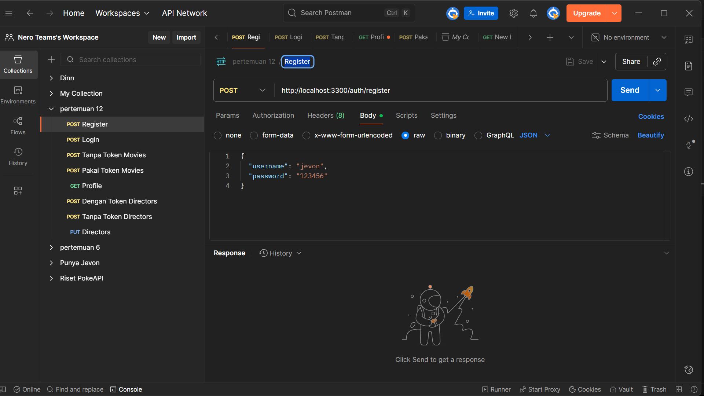

# Laporan Praktikum Interoperabilitas

## Pengamanan API dengan Autentikasi dan Autorisasi (JWT)

**Nama:** Moh. Jevon Attaillah
**NIM:** 362458302035
**Prodi:** Teknologi Rekayasa Perangkat Lunak
**Mata Kuliah:** Interoperabilitas
**Tahun:** 2025

---

## Landasan Teori

Pada modul ini saya mempelajari bagaimana cara mengamankan API menggunakan **autentikasi** dan **autorisasi** berbasis **JSON Web Token (JWT)** di Node.js.
Tujuannya adalah agar hanya pengguna yang memiliki kredensial valid yang bisa mengakses endpoint tertentu, terutama untuk operasi seperti menambah, mengubah, atau menghapus data.

Secara singkat:

* **Autentikasi** dipakai untuk memastikan siapa yang mengakses sistem.
* **Autorisasi** menentukan apa saja yang boleh dilakukan pengguna tersebut.
* **bcryptjs** digunakan untuk mengamankan password dengan cara *hashing* sebelum disimpan di database.
* **JWT** berfungsi sebagai token akses, sehingga server tidak perlu menyimpan sesi pengguna (*stateless*).

Dengan konsep ini, API jadi lebih aman dan tidak bisa diakses sembarangan.

---

## Persiapan

### 1. Instalasi Dependensi

Sebelum mulai, install dulu beberapa paket yang dibutuhkan:

```bash
npm install express sqlite3 bcryptjs jsonwebtoken dotenv
```

### 2. Konfigurasi File `.env`

Buat file `.env` untuk menyimpan konfigurasi:

```env
PORT=3300
DB_SOURCE_1="movies.db"
DB_SOURCE_2="directors.db"
JWT_SECRET="KUNCI_RAHASIA_SUPERKUAT"
```

---

##  Struktur Proyek

```
nodejs/
│
├── database.js
├── server.js
├── middleware/
│   └── authMiddleware.js
├── assets/
│   └── images/
├── .env
└── package.json
```

---

## Implementasi

### 1. File `database.js`

File ini digunakan untuk membuat dua database, yaitu `movies` dan `directors`.
Selain itu, ada juga tabel `users` untuk menyimpan akun pengguna. Password yang disimpan sudah di-*hash* agar tidak bisa dibaca langsung.

### 2. File `authMiddleware.js`

Berisi middleware untuk memverifikasi token JWT. Middleware ini memastikan bahwa setiap permintaan ke endpoint yang dilindungi memiliki token yang valid.

```js
function authenticateToken(req, res, next) {
  const authHeader = req.headers['authorization']
  const token = authHeader && authHeader.split(' ')[1]
  if (!token) return res.status(401).json({ error: 'Akses ditolak, token tidak ditemukan' })

  jwt.verify(token, JWT_SECRET, (err, decodedPayload) => {
    if (err) return res.status(403).json({ error: 'Token tidak valid atau kedaluwarsa' })
    req.user = decodedPayload.user
    next()
  })
}
```

### 3. File `server.js`

Berisi seluruh endpoint API.
Beberapa route utama di antaranya:

* **Autentikasi**

  * `POST /auth/register` → mendaftarkan akun baru
  * `POST /auth/login` → login dan mendapatkan JWT
  * `GET /profile` → melihat data user saat token valid
* **Movies (Proteksi Token)**

  * `POST`, `PUT`, `DELETE` → hanya bisa diakses jika sudah login
  * `GET` → bisa diakses siapa saja
* **Directors (Tugas Bab 3)**

  * `POST`, `PUT`, `DELETE` → dilindungi token
  * `GET` → publik

---

## Pengujian dengan Postman

Koleksi pengujian: **`pertemuan 12.postman_collection.json`**

| No | Nama Request           | Endpoint         | Metode | Token | Keterangan                                  |
| -- | ---------------------- | ---------------- | ------ | ----- | ------------------------------------------- |
| 1  | Register               | `/auth/register` | POST   | Tidak pakai     | Registrasi akun baru                        |
| 2  | Login                  | `/auth/login`    | POST   | Tidak pakai     | Login untuk mendapatkan JWT                 |
| 3  | Tanpa Token Movies     | `/movies`        | POST   | Tidak pakai     | Gagal karena belum login (401 Unauthorized) |
| 4  | Pakai Token Movies     | `/movies`        | POST   | Pakai     | Berhasil menambah data movie                |
| 5  | Tanpa Token Directors  | `/directors`     | POST   | Tidak pakai     | Gagal menambah sutradara tanpa token        |
| 6  | Dengan Token Directors | `/directors`     | POST   | Pakai     | Berhasil menambah sutradara setelah login   |
| 7  | Directors (PUT)        | `/directors/1`   | PUT    | Pakai     | Mengubah data sutradara dengan token        |
| 8  | Directors (DELETE)     | `/directors/1`   | DELETE | Pakai     | Menghapus data sutradara dengan token       |
| 9  | Directors Copy         | `/directors`     | GET    | Pakai     | Mengambil data sutradara (publik)           |
| 10 | Profile                | `/profile`       | GET    | Pakai     | Menampilkan data user dari token JWT        |

---

##  Bukti Hasil Pengujian

Berikut bukti hasil pengujian API menggunakan Postman.
Semua gambar disimpan di folder:
`D:\MATKUL\SEMESTER 3\Interoperabilitas\Praktikum\Pertemuan 6\nodejs\assets\images`

---

**1. Registrasi Akun Baru**



**2. Login dan Mendapatkan Token JWT**


**3. Melihat Profil Pengguna (Token Valid)**


**4. Mengambil Data Sutradara (Tanpa Token / Publik)**


**5. Gagal Menambah Movie Karena Tidak Ada Token**


**6. Berhasil Menambah Movie dengan Token**


**7. Gagal Menambah Sutradara Tanpa Token**


**8. Berhasil Menambah Sutradara Setelah Login**


**9. Mengubah Data Sutradara (PUT /directors/:id)**


**10. Menghapus Data Sutradara (DELETE /directors/:id)**


##  Kesimpulan

Dari hasil praktikum ini, sistem autentikasi berbasis JWT berhasil berjalan dengan baik.
Semua endpoint yang seharusnya dilindungi sudah tidak bisa diakses tanpa token.
Proses login dan register juga berfungsi sesuai harapan, dengan password yang terenkripsi.

Dengan penerapan JWT ini, API menjadi lebih aman, efisien, dan mudah digunakan tanpa perlu menyimpan sesi pengguna di server.

---